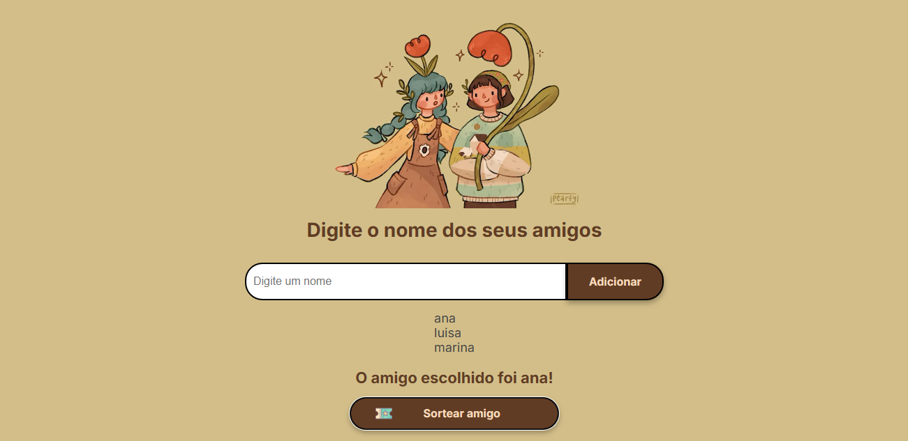

    <h1>👽 ONE: Oracle Next Education</h1>
    <h6>A repository dedicated to documenting my activities as a participant in the ONE program, a partnership between Oracle and Alura for Data Science.</h6>

 

## 15.01 ~ 18.03

Study period dedicated to courses for introductory programming with JavaScript / HTML / CSS and personal development focused on time management and emotional intelligence, as well as learning to use tools such as Trello, Git & GitHub.

Some programming logic exercises were done in JavaScript, making use of functions, arrays, and manipulating HTML tags within the scripts. You can check out some of these exercises through [this](https://github.com/itscypriano/oracle-next-education/blob/main/exercicios-curso2.jvs).

### Secret Santa Challenge
A challenge was also proposed, which consisted of building a script where the user could input names, and by clicking a "Draw" button, those names would be passed through a function that randomly selects one name using JavaScript:

You can try it by yourself [here](https://itscypriano.github.io/challenge-amigosecreto-ONE/)

### 7-Days-Challenge

This schedule consisted of solving 1 challenge per day for a week to reinforce some basic programming and JavaScript concepts.

* [Challenge 1](./desafio1.js)
>A challenge that aimed to reinforce learning about comparison operators

