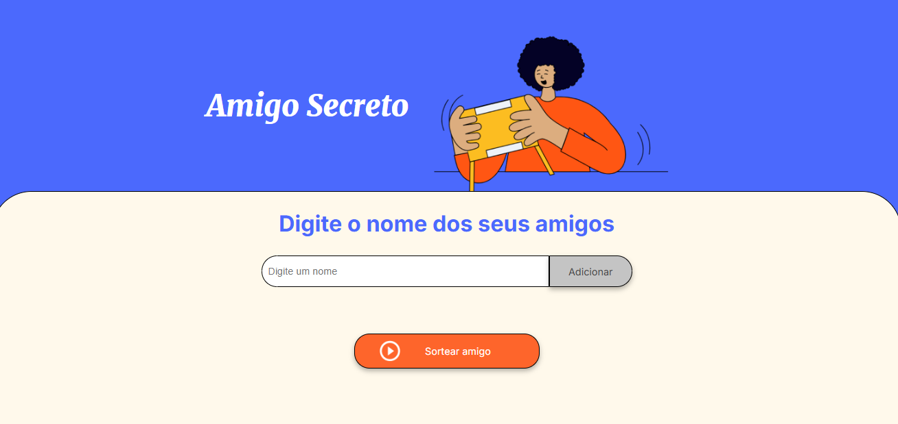
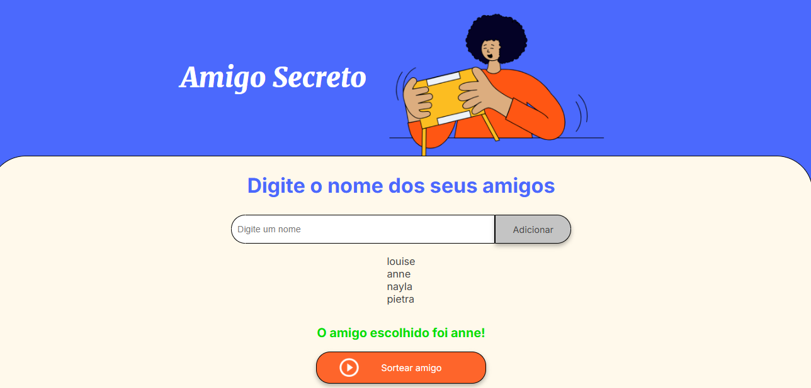

# CHALLENGE AMIGO SECRETO 🎭

<i><b>Desafio proposto pelo programa de estudos Oracle One</b></i>

 

Neste desafio do Oracle One, a proposta foi de usarmos JavaScript para criarmos um sie que nos permitisse criar um sorteio de amigos.

Foram usados diversos conceitos aprendidos durante os cursos de JavaScript da Alura para programadores iniciantes, incluindo arrays, variáveis e funções como Math.random e Math.floor, além de estrutura de funções e a aplicação de boas práticas de programação.

O código disponibilizado está documentado praticamente linha a linha!

O resultado final foi de um site funcional que atende os requisistos propostos pelo Oracle One:

